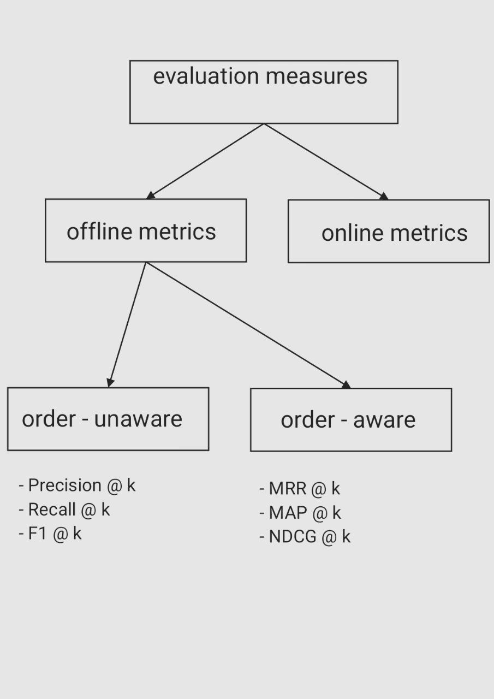
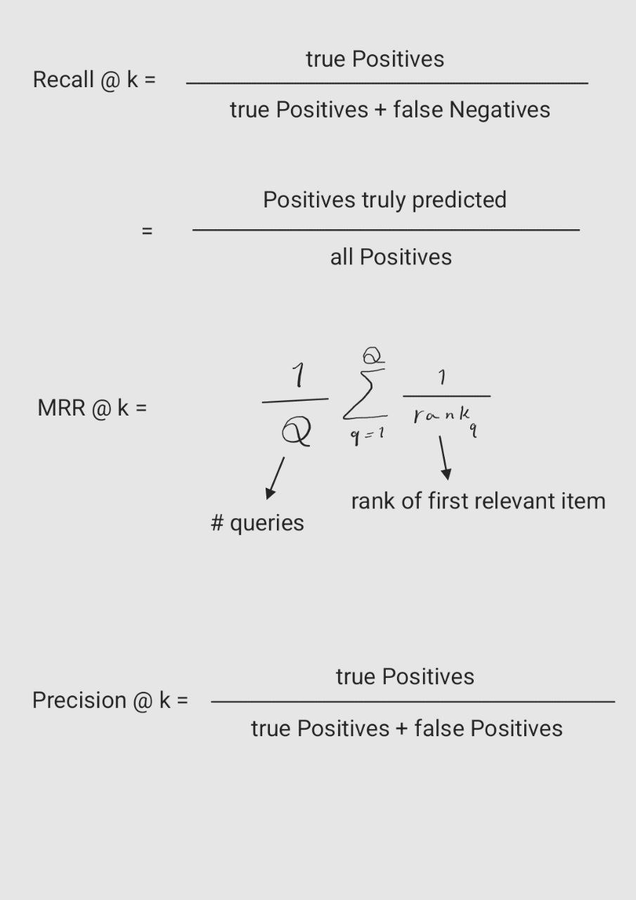
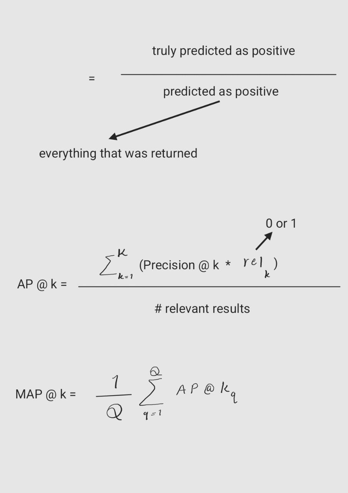
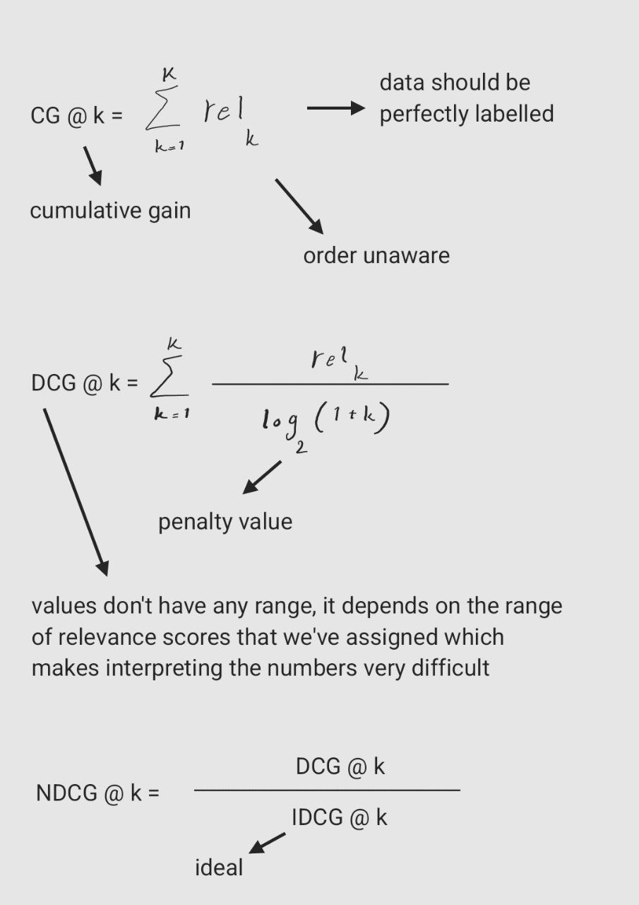
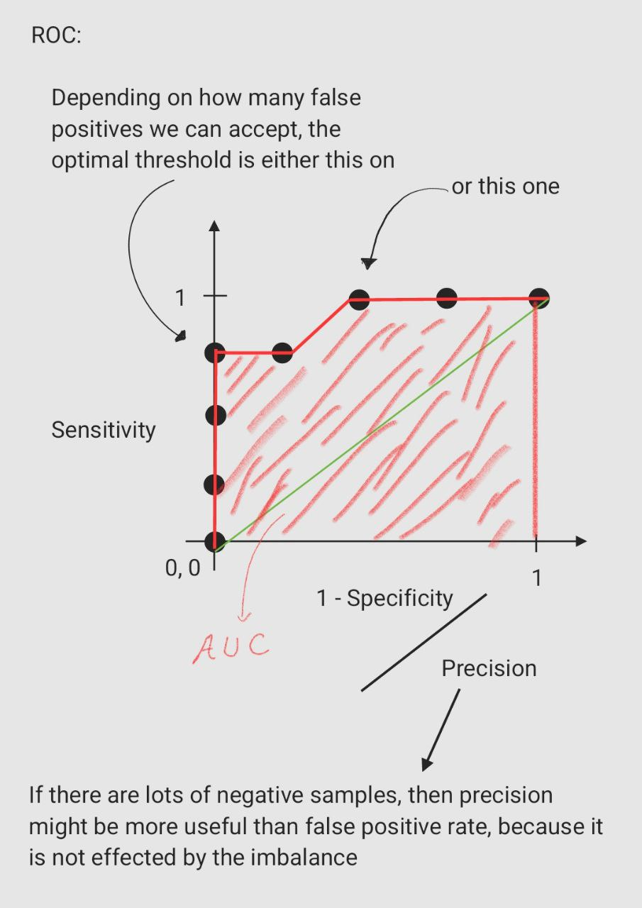
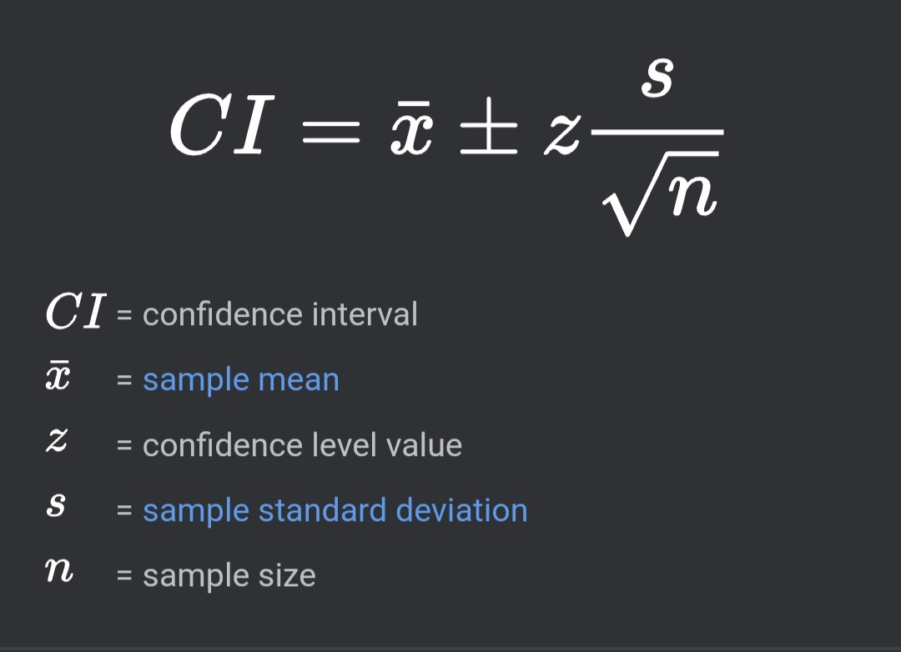
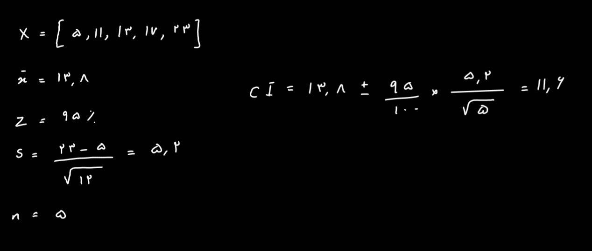
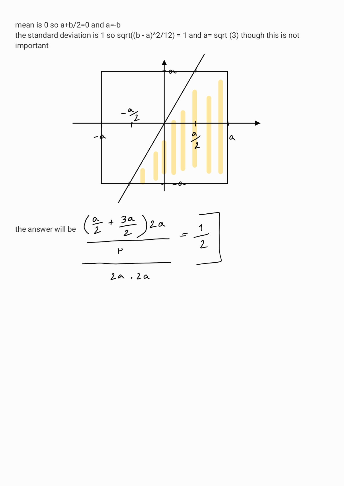
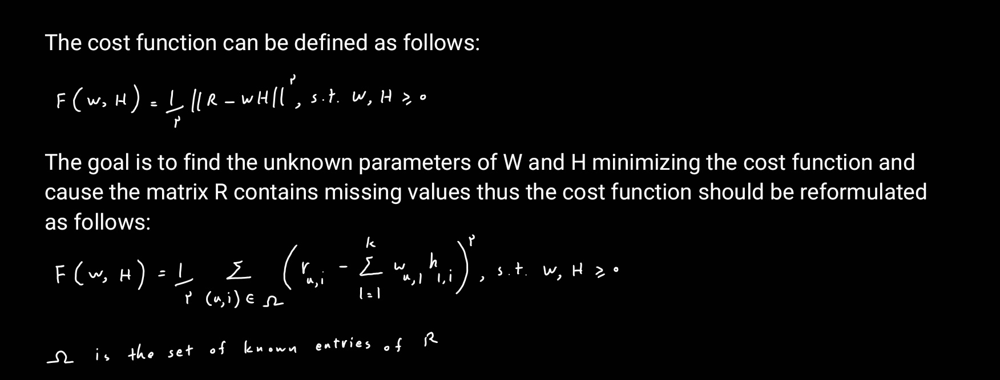

# Data Scientist Interview

When I wanted to become a backend developer my gorgeous [husband](https://github.com/1995parham) made some practical
interview with me then created a [repository](https://github.com/1995parham-teaching/interviews) and
put the questions and answers there.
Now I want to apply for a data scientist position in which unfortunately he has no experience, so I'm making this
repository and want to put all my practices here.

## Logical

1. you have buckets one 5 liters the other 3 liters, measure 4 liters:

   First I make the 3 liters bucket full and then pour it to 5 liters bucket then I make it full again and pour it to the
   5 liters bucket till it gets full, so the amount of water left in the 3 liters bucket is 1 liter then I make the 5 liters
   bucket empty and pour that 1 liter in it then make the 3 liters bucket full again and pour it to the 5 liters bucket
   which had 1 liter inside, so the result is 4 liters of water in the 5 liters bucket.

## ML algorithms

1. Differences between supervised and unsupervised:
   In supervised the data has label
2. How is logistic regression done?
3. Explain steps in decision tree
4. How do you build a random forest?
5. How can you avoid overfitting? Lasso regression
6. What are feature selection methods? Wrapper methods: forward selection, backward selection. Filter methods:
   Chi-Square, ANOVA (learn f-distribution, t-test, p-value, null hypothesis and significance level)
7. How do you deal with more than 30% missing value?
8. Explain dimensionality reduction and its benefits
9. How will you calculate eigenvalues and eigenvectors of a 3 by 3 matrix
10. How to maintain deployed model?
11. What are recommender systems? Collaborative, content-based
12. It rains on Saturday with 0.6 probability and rains on Sunday with 0.2 probability what is the probability that it
    rains this weekend?
13. How can you select k for k-means?
14. What is the significance of p-value?
15. How can outlier values be treated?
16. How can you say that a time series data is stationary?
17. How can you calculate accuracy using confusion matrix?
18. Write the equation and calculate precision and recall rate
19. If a drawer contains 12 red socks, 16 blue socks, and 20 white socks, how many must you pull out to be sure of
    having a matching pair?
20. _People who bought this, also bought..._ recommendations seen on Amazon is a result of which algorithm?
21. Write a SQL query to list orders with customer information?
22. You are given a dataset on cancer detection. You've built a classification model and achieved an accuracy of 96%. Why
    shouldn't you be happy with your model performance? What can you do about it?
23. Which of the following ML algorithms can be used for imputing missing values of both categorical and continuous
    variables? K-means-clustering → crash, linear regression → crash, Decision tree → crash, KNN works
24. calculate entropy [0,0,0,1,1,1,1,1]
25. What is the standard of the mean?
26. What is Mean Reciprocal Rank?
    
    
    
    
    
    
    
    

## Cafebazaar

I had to answer to a few questions in the first phase of interview for the data scientist position at Cafebazaar, and I
was rejected because the questions needed deep understanding of linear algebra which I had forgotten, I can't remember
what they exactly asked for, but I can give you a sense and another important point is that I now write the answer I
think is true, but I'm not sure so **don't rely on my answers**:<br/>

1. We generated 5 random numbers using uniform distribution from [0, d] and the numbers are 5, 11, 13, 17, 23 find the
   minimum d with more than 95% probability.
   
   So we can write
   
2. Given uniform distributions X and Y and the mean 0 and standard deviation 1 for both,
   what’s the probability of 2X > Y?
   
   As you see this question is super easy, but I couldn't answer 😂 because I
   didn't expect these kinds of questions so shout out to you, they ask something like this expect it.

3. What can you say about the rank of the matrix when the number of samples is many more than the number of features?
   Pay attention the first phase is a test, so there is no one who you can talk to or there is no box in which you can explain
   what you know if I had the chance I could say that in order to find out a linear regression model I know gradient
   descent and normal equation and in normal equation we should calculate the inverse of X multiplied by X transpose and
   this term is not invertible if the number of samples in many more than features or if features have high correlation
   with each other, but I just could check one answer about the rank I mean they ask for pure linear algebra.
   Well, I couldn't even remember what the rank of a matrix was. The **rank** of a matrix is the number of **linearly
   independent** columns (or rows), you can find the rank of a matrix using **echelon**. To be honest I don't have an
   intuition, but there is a theorem which says the column rank is equal to the row rank, so the first thing we can say is
   that the rank of this matrix at most will be the min(number of rows, number of columns). In this question the rank will
   be at most the number of samples.<br/>
   Full rank means the rank of the matrix is the largest possible number so if your features have high correlation with
   each other (and the number of features are less than the number of samples) your matrix won't be full rank.

## ROC

This part is not a question asked in any of the interviews, but I had to write it here cause it made me think of my whole
life decisions. This is the story happened to me which may happen to you too. Once I had to solve a coding challenge, it
was an imbalanced dataset, and I had to train a classifier. As you can guess precision is not a good metric in this
problem, cause even always predicting false gives you a high prediction. Then I found out that recall is as important as
precision, and the first thing popped to my mind was F1-score but then in my searches I heard about another metric called
ROC_AUC which was claimed to work well for an imbalanced dataset. That's wrong, in ROC_AUC we are calculating the area
under the receiver operating characteristic curve. In this curve the y-axis is the sensitivity or true positive rate:<br/>
True Positive Rate = True Positives / (True Positives + False Negatives)<br/>
It measures the proportion of the positive data that we classify correctly. The x-axis is the false positive rate:<br/>
False Positive Rate = False Positives / (False Positives + True Negatives)<br/>
it measures the proportion of the negative data that we classify as positive, so if your dataset is highly imbalanced, and
most of the data is labeled negative then the number of True Negative samples can affect the whole curve, if the model
classifies all samples as negative then the number of True Negative will be so large and False Positive Rate will be so
small, and it assumes the model is so good so this metric is not good at all for imbalanced dataset classification. To
solve it, we should use precision instead of false positive rate:<br/>
Precision = True Positives / (True Positives + False Positives)<br/>
it measures the proportion of the data the model classifies as positive is really positive, and the areas under this curve
can be used as a good metric.

# SGD, Momentum, Adam

These optimizations were not asked in interview, but it's highly important to fully understand them:<br/>

Stochastic Gradient Descent: In regular gradient descent we should bring whole the training dataset to our calculations
which will be so much if our dataset is so large and our model has so many parameters. In this situation we can use
SGD, this algorithm stochastically chooses a mini batch of the dataset in each step and does the calculation.</br>

Momentum: I always think about this optimization with a physics intuition. The problem is that we want to make gradient
descent faster and avoid oscillation. We change the calculations this way:<br/>
"V" of derivative of "W" (parameters of the model) is equal to "B" (hyper parameter) multiplied by "V" of
derivative of "W" plus derivative of "W".<br/>
Then "W" in each step is updated this way:<br/>
"W" will be equal to "W" minus learning rate multiplied by "V" of derivative of "W"<br/>
In here I see "V" as velocity and derivative of "W" as acceleration. As the equations show if faster move in one
dimension is needed then the acceleration makes velocity bigger and bigger each step, and the parameters of the model will
be updated faster and faster and if one dimension oscillate in regular gradient descent in this algorithm acceleration
will be positive one step and negative the other step and doesn't let velocity to get big so parameters will not change
a lot.

Adam: I had an intuition for SGD that we use a mini-batch instead of the whole dataset cause our dataset is so large
or the model has so many parameters, and I even had a physics intuition for Momentum optimization that to avoid oscillating
and make the algorithm faster we use what I called "velocity" and "acceleration" to move faster in a dimension needed and
avoid oscillating by changing the parameters by "V" of derivative of "W" but to be honest I have no intuition for ADAM
optimization, I've seen the algorithm and this is something I can't understand but is working

# binary cross entropy


# Imputation methods

I can guarantee they will ask you this question. It has some simple answers but make sure you review them before the
interview:<br/>

#### Simple

1. Drop the Nulls.
2. Replace them with mean or median

#### Medium

1. Use the mean or median but not of the whole column, only of a few samples that are close to it.
2. Pick an algorithm or change them, so they don't crash because of Null, they just don't put the Null into calculation.
3. Predict the Nulls. You can choose the column which has Nulls as your target column and then the known values can be
   used for training, then we can predict the unknown values by a simple regression.

#### Pro

1. Mice (Multivariate Imputation By Chained Equations)algorithm: If you've gotten the idea of predicting the Null values
   by regression (part 3 of Medium) this algorithm will be super easy. Most probably more than just one column in your
   dataset contains Null values:<br/>
   1. Replace the Null values by the mean of their column.
   2. Go through the columns and for each of them predict the Null values by regression (And other columns don't contain
      Nulls).
   3. Calculate the difference between the new matrix and the previous one.
   4. If the matrix is not close to zero then do the step two and three again.
2. Matrix Factorization: I'll go through an example, suppose you wanna build a recommender system for Netflix when a
   person creates an account you ask them to score how much they like specific categories and knowing this can help you
   a lot, but most of the people just skip the part now you have a matrix R of size n*m where n is the number of users and
   m is the number of categories and it contains so many Nulls. Consider a positive integer k <= min(n,m), the main
   objective is to find matrix factors W with size n*k and H is size k\*m in which R is close to WH. As these matrices are
   completed, the predicted rating of user u to item i (r at index u and i) can be estimated by the inner product of the
   corresponding user-item feature vector pairs.
   
   Estimating the parameters of W and H can be achieved by searching around the global (or local) minimum of the quadratic
   cost function F and once it's done, the other missing values can be estimated by the inner product too.

# Categorical encoding

This is another most repeated questions, how will you transform categorical columns to numerical columns?

#### Simple

1. Ordinal encoder and Label encoder
2. One hot encoder and Dummy encoder

#### Medium

1. Hashing: By hashing we can transform the categories into a fixed size number
2. Base N encoding: We can first use ordinal encoding and then transform the numbers by base N, look at the example below:

| Categorical Column |
| ------------------ |
| A                  |
| B                  |
| C                  |
| D                  |
| E                  |
| F                  |
| G                  |
| H                  |
| I                  |

ordinal encoding

| Categorical Column |
| ------------------ |
| 1                  |
| 2                  |
| 3                  |
| 4                  |
| 5                  |
| 6                  |
| 7                  |
| 8                  |
| 9                  |

base 4

| Categorical | Column |
| ----------- | ------ |
| 0           | 1      |
| 0           | 2      |
| 0           | 3      |
| 1           | 0      |
| 1           | 1      |
| 1           | 2      |
| 1           | 3      |
| 2           | 0      |

# Tricky question

## Encoding cyclical continuous features

Let’s explore a simple 24-hour time dataset, we want to convey its cyclical nature to our model.

| Seconds Past Midnight |
| --------------------- |
| 192                   |
| 212                   |
| 299                   |
| 300                   |
| 353                   |
| 400                   |

we want our machine learning model to see that 23:55 and 00:05 are 10 minutes apart, but as it stands, those times will
appear to be 23 hours and 50 minutes apart!<br/>

Here's the trick: we will create two new features, deriving a sine transform and cosine transform of the
seconds-past-midnight feature. We can forget the raw “seconds” column from now on.

```python
seconds_in_day = 24*60*60

df['sin_time'] = np.sin(2*np.pi*df.seconds/seconds_in_day)
df['cos_time'] = np.cos(2*np.pi*df.seconds/seconds_in_day)

df.drop('seconds', axis=1, inplace=True)

df.head()
```

Notice that now, 5 minutes before midnight and 5 minutes after is 10 minutes apart

## Digikala

My interview experience with digikala was much more reasonable than cafebazaar. I was asked any kind of question from
easy to hard. I had to **code**, know **sql**, know **ml models**, know **statistics**, and the nice thing was that in
each of them the understanding was much more important than answering completely and all the questions were example based
again I can't remember every detail but here's what I remember:<br/>

1. bias/variance tradeoff. not only the meaning, but I had to explain it in different situations for example: When you
   are using a random forest instead of a decision tree, what are you doing about bias/variance? I'm reducing variance.

2. explain bagging and boosting and how each of them affect bias/variance: In bagging we train a few models of the same
   type with different datasets and then use voting among them. In boosting we train a model with whole dataset, and we
   increase the weight of the samples which are wrongly predicted and then train the second model by this dataset and
   so on. They both decrease the variance.

3. I tell you to measure the height of the people in your college, what is distribution? Normal. Now I tell you to measure
   the height of girls and boys in your college separately, what is the distribution? More normal. Now I tell you to
   measure their salary, what is the distribution? Normal. What is the difference between these two distribution? the
   salary distribution has a heavier tail than the height distribution.

4. Do you know what q-q plot is? This question was great although I couldn't answer. Here it is, what it tries to understand
   is whether a dataset is normally distributed or uniformly distributed or ... or if two datasets' distribution is the
   same. Assume you have a dataset with fifteen samples, and you wonder if this dataset is normally distributed,<br/>
   Step1 : Give each point its own quantile<br/>
   Step2 : Get yourself a normal curve(any normal curve will do)<br/>
   Step3 : Add the same number of quantiles to the curve as you created for the data(here 15)(For the normal curve, "
   equal sized groups" means that there is an equal probability of observing a value within each group this means that
   groups on the edge must be wider and groups in the middle are narrower)<br/>
   Step4 : Now plot q-q graph : The plot contains dots showing where the quantiles from our dataset intersected with the
   quantiles from the distribution.
   Step5 : If the data were distributed like the distribution we selected, most of the points would be on a straight line.

You can also use q-q plot to see if two datasets follow the same distribution: assume we have a dataset with 15 samples
and another one with just four samples, we determine four quartiles for the larger dataset and compare those

5. The next question was if I had ever worked with spark? Let's do it<br/>
   Check [here](https://github.com/elahe-dastan/jaraghe)

6. Prove Pythagoras.
   

I had to do a **code challenge** for digikala too which is in a separate repository, check [here](https://github.com/elahe-dastan/digikala-datascientist-interview)

## P-value
The hypothesis that there is no difference between things is called the null hypothesis. The null hypothesis does not require any preliminary data because the only value that represents no difference is 0.
The closer a p-value is to 0, the more confidence we have that things A and B are different.
While a small p-value helps us decide if thing A is different from thing B, it does not tell us how different they are.
A p-value is composed of three parts:
1. The probability random chance would result in the observation.
2. The probability of observing something else that is equally rare.
3. The probability of observing something rarer or more extreme.

## Screening
You are training a linear regression model on a representative sample in order to predict house prices. Performance tests suggest that the model has an issue of high estimator bias in combination with low estimator variance. What action below is likely to solve the high bias issue?
• A: Collect more labeled data.
• B: Add higher-order polynomial terms.
• C: Increase the weights on regularization terms.
• D: Use a subsample of the data.

**My answer is B**

## Apple
What do you do if your model is overfitted?

Name a few loss function:
•  Mean Squared Error (MSE)

•  Cross-Entropy Loss: Often used in classification problems, especially with softmax activation in neural networks.

•  Hinge Loss: Used primarily for support vector machines (SVMs) for classification.

•  Log Loss: Also known as binary cross-entropy, used for binary classification problems.

•  Mean Absolute Error (MAE)

•  Huber Loss: Combines MSE and MAE to be less sensitive to outliers than MSE.

Name a few metrics:
•  Precision

•  Recall (Sensitivity)

•  F1 Score

•  Area Under the ROC Curve (AUC-ROC)

•  MAP & Mean Absolute Percentage Error (MAPE)

•  MSE & Root Mean Squared Error (RMSE)

•  R2

•  All ranking metrics like MRR and NDCG


