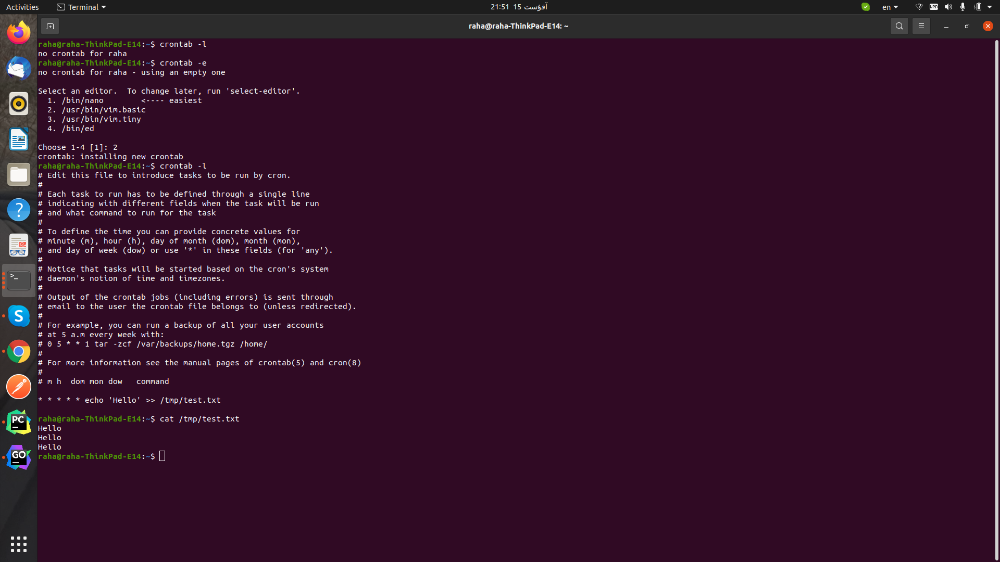

# Gradient Boost (for regression)
It's similar to AdaBoost:
1. AdaBoost starts by a stump but gradient boost starts by a leaf (average)
2. Trees is AdaBoost have different amount of say based on how they compensate the previous stump's error, this is not 
   the case in gradient boost 
   
## How Gradient Boost works (for regression)
1. Calculate average
2. Calculate the errors of the previous tree. The error is Residual = (Observed - Predicted)
3. Build a tree based on the previous residuals. This tree tries to predict the residuals. **(strange huh?)**. If some 
records place in the same leaf, we place the average of the records.
4. Now we can combine the original leaf with the new tree to make a new prediction (Doing it this way may cause high 
   variance, so we should scale the contribution from the new tree, and we do it by using a learning rate)
   
# XGBoost
It's eXtreme and it's Gradient Boost
## a unique regression tree
1. Make an initial prediction (default = 0.5)
2. Fit a Regression Tree to the residuals (just like Gradient Boost):
    1. Each tree starts as a single leaf and all the residuals go to the leaf
    2. Calculate a similarity score for the residuals(we are in the root): Similarity Score = Sum of Residuals, Squared / (Number of Residuals + lambda)
    (lambda is a regularization parameter and is intended to reduce the prediction's sensitivity to individual observations)
3. Split the observations into two groups based on a threshold and calculate the similarity score for both the left and the 
right leaf.
4. Calculate Gain: Gain = Left similarity + Right similarity - Root similarity
5. Calculate the gain for other thresholds and pick the largest gain.
6. If we can continue splitting in one leaf, we'll go ahead
7. **Prune**: we prune the tree by gain value and picking a number called gamma
8. After making the tree we calculate the output value, Output Value = Sum of Residuals / (Number of Residuals + lambda)
9. Like Gradient Boost we calculate the predictions (default learning rate called eta is 0.3)

# Cron job
Cron is so amazing

