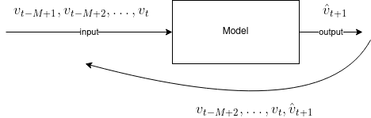

# Gradient Boost (for regression)
It's similar to AdaBoost:
1. AdaBoost starts by a stump but gradient boost starts by a leaf (average)
2. Trees is AdaBoost have different amount of say based on how they compensate the previous stump's error, this is not 
   the case in gradient boost 
   
## How Gradient Boost works (for regression)
1. Calculate average
2. Calculate the errors of the previous tree. The error is Residual = (Observed - Predicted)
3. Build a tree based on the previous residuals. This tree tries to predict the residuals. **(strange huh?)**. If some 
records place in the same leaf, we place the average of the records.
4. Now we can combine the original leaf with the new tree to make a new prediction (Doing it this way may cause high 
   variance, so we should scale the contribution from the new tree, and we do it by using a learning rate)
   
# XGBoost
It's eXtreme and it's Gradient Boost
## a unique regression tree
1. Make an initial prediction (default = 0.5)
2. Fit a Regression Tree to the residuals (just like Gradient Boost):
    1. Each tree starts as a single leaf and all the residuals go to the leaf
    2. Calculate a similarity score for the residuals(we are in the root): Similarity Score = Sum of Residuals, Squared / (Number of Residuals + lambda)
    (lambda is a regularization parameter and is intended to reduce the prediction's sensitivity to individual observations)
3. Split the observations into two groups based on a threshold and calculate the similarity score for both the left and the 
right leaf.
4. Calculate Gain: Gain = Left similarity + Right similarity - Root similarity
5. Calculate the gain for other thresholds and pick the largest gain.
6. If we can continue splitting in one leaf, we'll go ahead
7. **Prune**: we prune the tree by gain value and picking a number called gamma
8. After making the tree we calculate the output value, Output Value = Sum of Residuals / (Number of Residuals + lambda)
9. Like Gradient Boost we calculate the predictions (default learning rate called eta is 0.3)

# Cron job
Cron is so amazing

# A* (path finding)
In each step A* picks the node according to a value 'f' which is equal to the sum of 'g' and 'h', it picks the node 
having the lowest 'f'. 
g(n) is the cost of the path from the start node to n. 
h(n) is a heuristic that estimates the cost of the cheapest path from n to the target node. (this heuristic can be the
length of a straight line from the node n to the target)

# valhalla
Routing engine: [valhalla](https://github.com/valhalla/valhalla) implementing A*

# Map Matching
Taking in raw GPS signals (which are so noisy and sparse because of high buildings and resident vehicles) and mapping 
them to road segments that the GPS signals actually correspond to. 
**Input:** GPS Signal
1. Latitude
2. Longitude
3. Speed
4. Course

**Output:** Positions on a road network
1. Latitude (on an actual road)
2. Longitude (on an actual road)
3. Road Segment ID
4. Road Name
5. Direction/heading

We need both online and offline map matching

## Solving map matching using HMM
1. For every GPS signal find the k closest road segments (candidate selection)
2. Project the GPS signals on the candidate road segments
   
3. Now we have both the observations and the hidden states, and we have to calculate the emission probability
4. Calculate the transition probability
5. Run Viterbi algorithm

[This link](https://github.com/bmwcarit/barefoot) refers to a famous repo owned by BMW company which has implemented a 
map matcher (using HMM)

# Feature Importance
Suppose you have so many features and want to find out which one is more important for you. There are so many ways that 
work for all kind of models like **wrapper methods:** forward selection, backward selection. **filter methods:** 
   Chi-Square, ANOVA (learn f-distribution, t-test, p-value, null hypothesis and significance level). For decision tree
you can also use **information gain** to select the more important features.

# Multi step ahead prediction
1. Use neural networks (they are multi-input multi-output)
2. Direct: Have a specific model for each output
3. Recursive: Use window based approach.
   
4. Direct-Recursive: Have different models, and the output of the first model is the input of the second one.

# Great-circle distance
It is the shortest distance between two points on the surface of a sphere, measured along the surface of the sphere (as 
opposed to a straight line through the sphere's interior). The distance between two points in Euclidean space is the 
length of a straight line between them, but on the sphere there are no straight lines. In spaces with curvature, straight 
lines are replaced by geodesics. Geodesics on the sphere are circles on the sphere whose centers coincide with the center 
of the sphere, and are called great circles. 

# Mean
1. Arithmetic mean
   
Example: I have speed a for 1 minute and have speed b for the next 1 minute what's my average speed: (a+b)/2
2. Geometric mean: 
   
Example: My stock raises a% the first year and b% the next year what's the average raise: sqrt(a*b)
3. Harmonic mean:

Example: I have speed a for d meters and have speed b for the next d meters what's my average speed: 2/(1/a + 1/b)